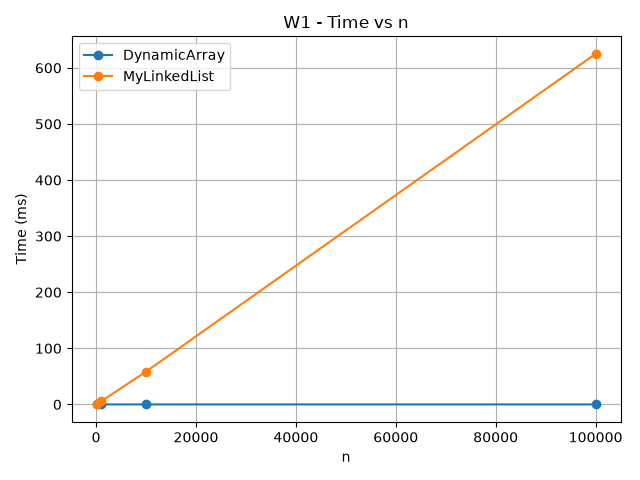
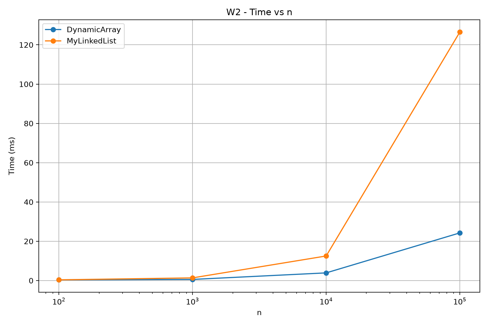
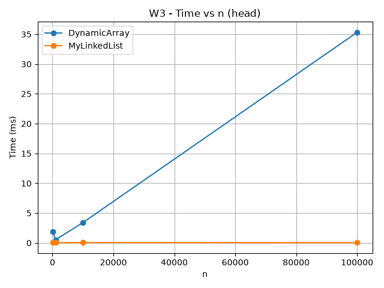
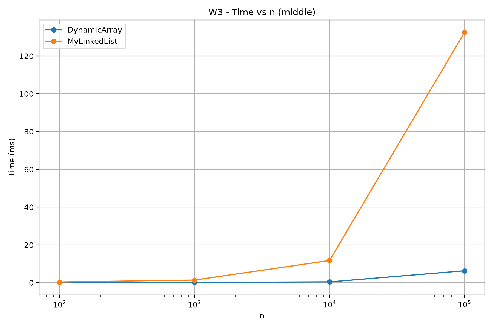
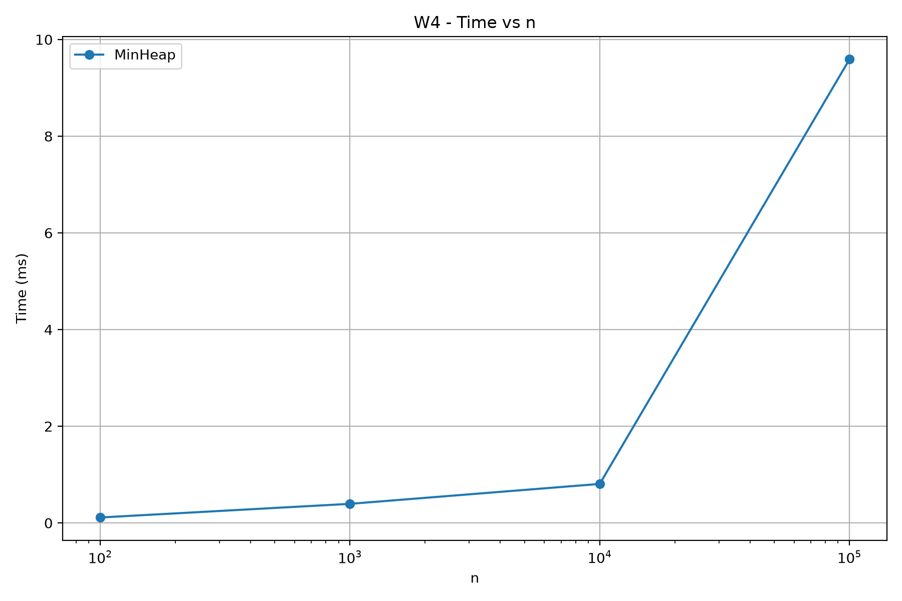
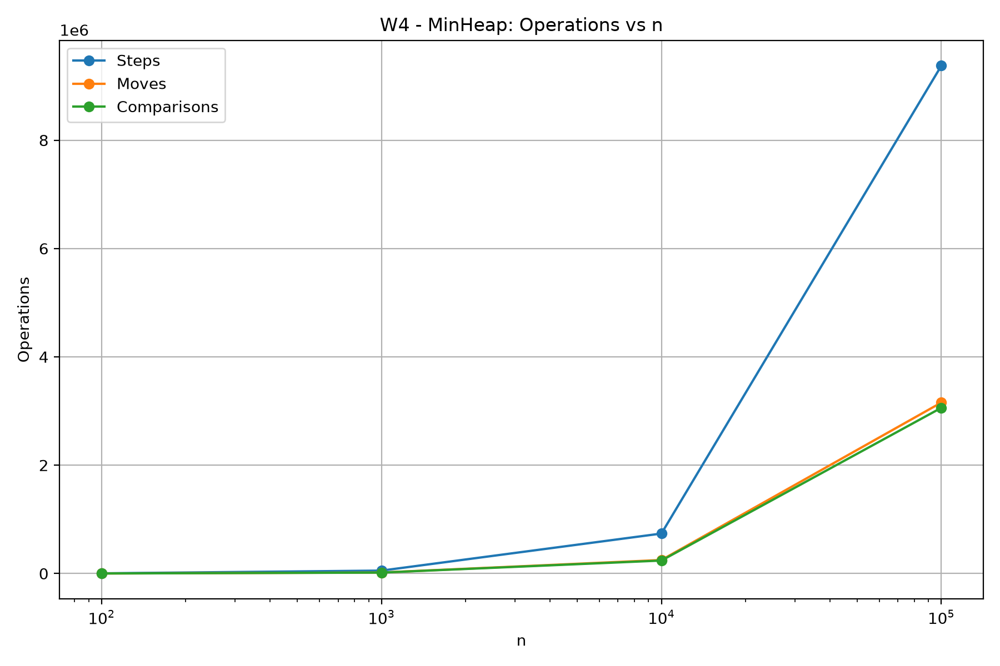

# Assignment 2 - Data Structures Report

## 1. Complexity Analysis

This project implements three data structures from scratch: DynamicArray, MyLinkedList and MinHeap. The following tables show the best, average and worst-case time complexity of every required operation. Auxiliary space means additional memory used by the operation.

### 1.1 DynamicArray

| Operation | Best Case | Average Case | Worst Case | Auxiliary Space |
|---|---|---|---|---|
| `get(index)` | Θ(1) | Θ(1) | Θ(1) | Θ(1) |
| `contains(x)` | Θ(1) | Θ(n) | Θ(n) | Θ(1) |
| `add(x)` | Θ(1) | Amortized Θ(1) | Θ(n) | Θ(n) during resize |
| `add(index, x)` | Θ(1) | Θ(n) | Θ(n) | Θ(n) during resize |
| `remove(index)` | Θ(1) | Θ(n) | Θ(n) | Θ(1) |

**Justification:**

- `get(index)` directly accesses `arr[index]`, so its running time is constant.
- `contains(x)` is Θ(1) when the value is found at the first position, but it may scan all `n` elements.
- `add(x)` normally adds one value at the end in Θ(1). When the internal array is full, a new array with double capacity is created and all elements are copied, giving Θ(n) in that operation. Because resizing does not happen on every insertion, the amortized complexity is Θ(1).
- `add(index, x)` may have to shift all elements after the specified index to the right. Inserting at the end with free capacity is Θ(1), while insertion near the beginning is Θ(n).
- `remove(index)` shifts all elements after the removed element one position to the left. Removing the last element is Θ(1), while removing the first element is Θ(n).

### 1.2 MyLinkedList

| Operation | Best Case | Average Case | Worst Case | Auxiliary Space |
|---|---|---|---|---|
| `get(index)` | Θ(1) | Θ(n) | Θ(n) | Θ(1) |
| `contains(x)` | Θ(1) | Θ(n) | Θ(n) | Θ(1) |
| `add(x)` | Θ(1) | Θ(n) | Θ(n) | Θ(1) |
| `add(index, x)` | Θ(1) | Θ(n) | Θ(n) | Θ(1) |
| `remove(index)` | Θ(1) | Θ(n) | Θ(n) | Θ(1) |

**Justification:**

- `get(index)` starts from `head` and moves through nodes until the required index is reached. Index `0` is Θ(1), but later indexes require traversal.
- `contains(x)` may find the value in the first node, but in the worst case it checks every node.
- `add(x)` in this implementation does not use a `tail` reference, so it traverses the list to find the last node. The empty-list case is Θ(1), while normal insertion at the end is Θ(n).
- `add(index, x)` is Θ(1) for index `0`, but insertion in the middle or near the end requires traversal.
- `remove(index)` is Θ(1) for the head, but other positions require moving to the node before the removed node.

### 1.3 MinHeap

| Operation | Best Case | Average Case | Worst Case | Auxiliary Space |
|---|---|---|---|---|
| `peekMin()` | Θ(1) | Θ(1) | Θ(1) | Θ(1) |
| `insert(x)` | Θ(1) | O(log n) | Θ(log n) | Θ(n) during resize |
| `extractMin()` | Θ(1) | Θ(log n) | Θ(log n) | Θ(1) |

**Justification:**

- `peekMin()` directly returns `heap[0]`, because the minimum value is always stored at the root.
- `insert(x)` first adds the new value at the end. If the heap property is already satisfied, the operation finishes quickly. Otherwise, bubble-up may move the element from the bottom to the root, which takes at most the height of the heap, Θ(log n). Resizing can additionally require Θ(n) temporary space.
- `extractMin()` removes the root and moves the last element to index `0`. Bubble-down may then move this element through the height of the heap, giving Θ(log n) in the worst case.

---

## 2. Loop Invariant Proofs

### 2.1 DynamicArray `contains(x)`

The `contains(x)` method scans the DynamicArray from index `0` to `size - 1`.

#### Invariant

Before every iteration with index `i`, all elements from index `0` to `i - 1` have already been checked and none of them is equal to `x`.

#### Initialization

Before the first iteration, `i = 0`. No elements have been checked yet. The range from `0` to `i - 1` is empty, so the invariant is true.

#### Maintenance

Assume the invariant is true before iteration `i`. The algorithm compares `arr[i]` with `x`.

If `arr[i] == x`, the method immediately returns `true`, which is correct.

If `arr[i] != x`, then all elements from `0` to `i` have been checked and none is equal to `x`. Therefore, before the next iteration, the invariant is still true.

#### Termination

The loop terminates either when the value is found or when `i == size`.

If the loop reaches `size`, every valid element from index `0` to `size - 1` has been checked and none is equal to `x`.

#### Conclusion

Therefore, `contains(x)` returns `true` exactly when `x` exists in the DynamicArray and returns `false` when the value is absent.

---

### 2.2 MinHeap `bubbleDown(index)`

The `bubbleDown` method restores the MinHeap property after the root or another node may become larger than one of its children.

#### Invariant

Before every iteration, the MinHeap property is correct everywhere except possibly between the node at `index` and its children. The subtrees below its children are already valid MinHeaps.

#### Initialization

After `extractMin()`, the last heap element is moved to index `0`. Before this change, all subtrees were valid heaps. Therefore, only the new root may violate the heap property with its children. The invariant is true before the first iteration.

#### Maintenance

The algorithm finds the smallest value among the current node, its left child and its right child.

If one of the children is smaller, the current node is swapped with the smallest child. After the swap, the heap property is correct at the previous position. A possible violation can now exist only at the new lower position.

Therefore, the invariant remains true before the next iteration.

#### Termination

The loop stops when the current node is already the smallest among itself and its children, or when it has no children.

At this point there is no remaining violation between the current node and its children.

#### Conclusion

Because all other parts of the heap were already valid and the possible violation was moved downward until it disappeared, `bubbleDown` restores the MinHeap property for the entire heap.

---

## 3. Benchmark Methodology and Results

The benchmark uses the following sizes:

- `n = 100`
- `n = 1,000`
- `n = 10,000`
- `n = 100,000`

The same input data is generated using `new Random(42)` to make the experiment reproducible.

Each benchmark case is executed once as a warm-up run. The warm-up result is discarded. After that, the case is executed five times and the median running time is saved.

Running time is measured using `System.nanoTime()` and stored internally as `long`. Before writing to the CSV file, nanoseconds are converted to milliseconds.

The physical operation counters follow these rules:

- **step** - one array-cell read or one move to the next linked-list node;
- **move** - one existing array element moved to another position or one linked-list pointer update;
- **comparison** - one comparison between two stored values.

The final data is stored in `results/results.csv`.

### 3.1 W1 - Random Access

W1 performs 10,000 random `get(index)` operations on DynamicArray and MyLinkedList.

The DynamicArray measurements reported exactly `10,000` steps for every tested value of `n`:

- `n = 100` → 10,000 steps
- `n = 1,000` → 10,000 steps
- `n = 10,000` → 10,000 steps
- `n = 100,000` → 10,000 steps

This matches the implementation because every DynamicArray `get(index)` requires exactly one array-cell access.

MyLinkedList requires traversal from the head to the requested index. Therefore, the number of steps grows with the requested indexes and the structure size.

### 3.2 W2 - Search

W2 performs 1,000 `contains(x)` queries for each structure. Half of the searched values are present in the structure and half are guaranteed to be absent.

Both DynamicArray and MyLinkedList have linear search complexity. However, their real running times can still be different because arrays store primitive values in contiguous memory while linked-list nodes are separate objects connected by references.

### 3.3 W3 - Insert and Remove

W3 contains two variants.

The **head** variant performs 1,000 insertions and 1,000 removals at index `0`.

For MyLinkedList head operations, the measured counters were:

- `steps = 0`
- `moves = 3,000`
- `comparisons = 0`

for every tested `n`.

This result is expected. Each of the 1,000 head insertions performs two pointer updates, giving 2,000 moves. Each of the 1,000 head removals performs one pointer update, giving another 1,000 moves.

The **middle** variant performs the same number of operations at index `n / 2`.

Middle operations are expensive for MyLinkedList because the algorithm must first traverse nodes to reach the requested index. DynamicArray does not need traversal by pointer, but it must shift many elements during insertion and removal.

### 3.4 W4 - Priority Processing

W4 inserts `n` values into MinHeap and then performs `n` calls to `extractMin()`.

The benchmark also checks that extracted values are returned in non-decreasing order.

The measured operation counts increased with `n`:

| n | Steps | Moves | Comparisons |
|---:|---:|---:|---:|
| 100 | 3,287 | 1,117 | 1,035 |
| 1,000 | 53,645 | 18,193 | 17,226 |
| 10,000 | 737,753 | 249,095 | 239,329 |
| 100,000 | 9,374,609 | 3,156,359 | 3,059,125 |

This growth is consistent with repeated heap operations that can move through the height of the binary heap.

---

## 4. Discussion

DynamicArray is very efficient for random access because an element can be accessed directly by its index. The W1 results confirm this because 10,000 `get` calls always produced exactly 10,000 steps, independently of `n`. Arrays also have good spatial locality because primitive `int` values are stored close to each other in memory. When one part of an array is loaded into a CPU cache line, nearby values may also become available in the cache. MyLinkedList does not have the same memory layout because every node is a separate object. To reach a later node, the program must follow references from one node to the next, which is called pointer chasing. This can produce more cache misses and make the linked list slower even when two operations have similar Big-O complexity. Linked-list nodes also require additional memory for object headers and references. Creating many separate node objects can also increase work for the garbage collector. However, MyLinkedList is useful for operations at the head because insertion and removal can be performed without shifting existing elements. The W3 head results show this behavior: the number of steps remained zero while only pointer updates were required. DynamicArray is a better choice when frequent indexed access and sequential iteration are important. MinHeap is a better choice for priority-based processing because the smallest value is always available at the root in constant time. Insert and extract operations preserve the heap property using bubble-up and bubble-down and require at most logarithmic-height traversal. Overall, the experiment shows that Big-O complexity is important, but memory layout, cache locality, pointer chasing and actual physical operations also have a significant effect on real execution time.